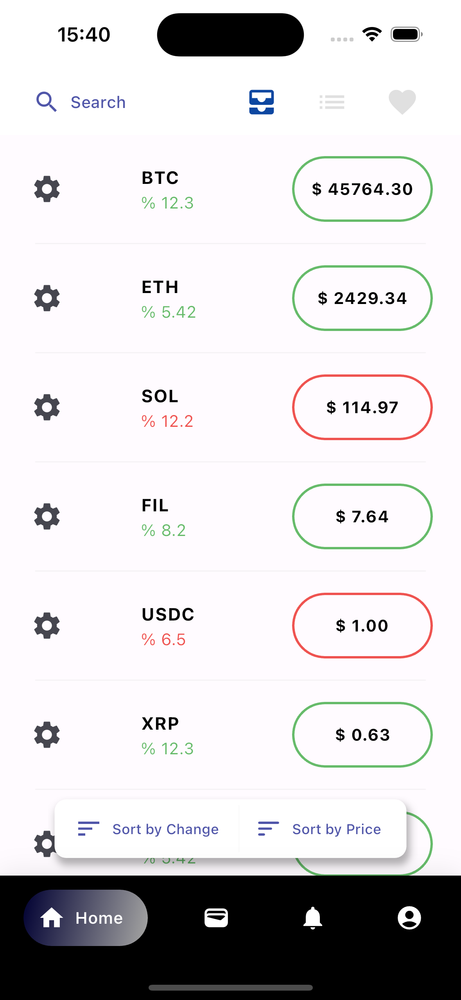
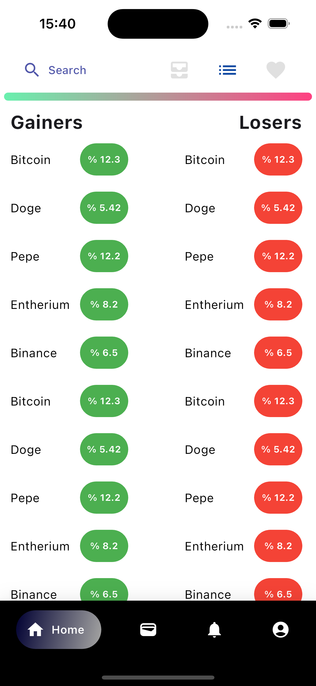
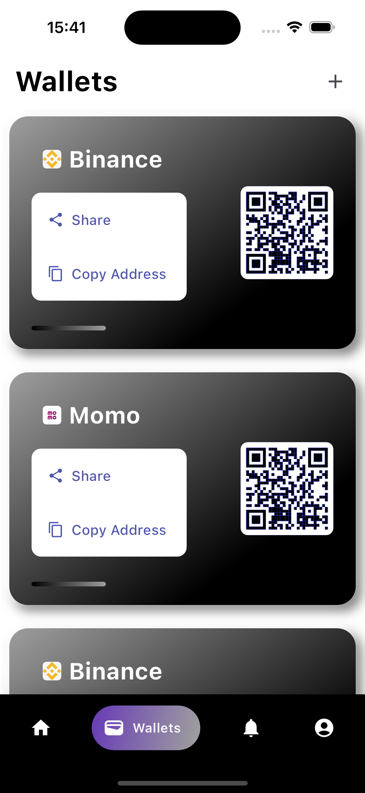
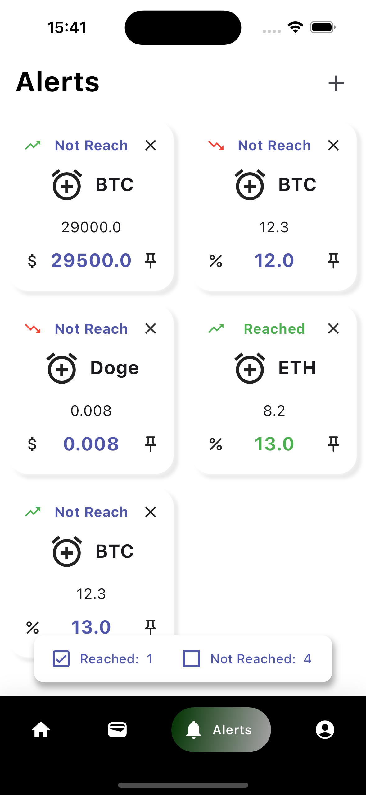

# coin_app

An app to tracking the crypto's price. With a user friendly UX/UI.

---

Features:

- Catching up price, status.
- Add Alert, Add Wallet.

Technologies:

- Bloc - state management.
- Http - fetching data.

---

PICS DEMO

    
    
    
    
    

